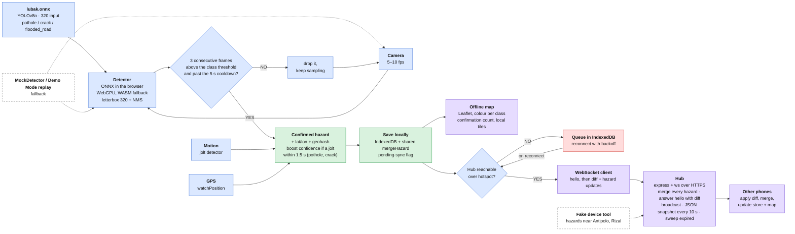
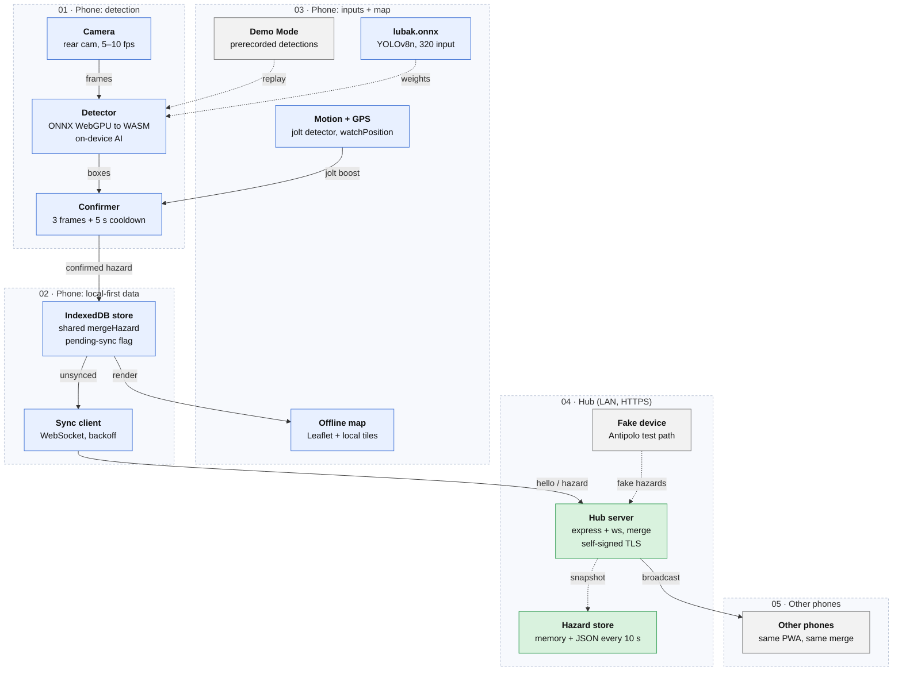

# The flowchart and the architecture, as text

Two drawings describe how Lubak Alert is meant to work: a **flowchart** (the decisions: *detect, confirm, share, offline-first*) and an **architecture** drawing (the lanes: phone, hub, other phones).
Both are kept here as Mermaid, so they live in git and render on GitHub, and **every box and arrow is tied to the code that implements it and the test that fails when it stops being true**.
`npm test` runs those tests; the main one is [`test/flowchart.test.ts`](../test/flowchart.test.ts), which walks the chart in order with the real pipeline, confirmer, store, sync client and hub (over TLS) in one process.

If you change a number or an arrow, change the chart, the code and the test together. A failing flowchart test means the code stopped doing what the chart says: fix the code, or change the chart on purpose.

## 1. The flow

Colours as in the drawing: blue = sensing and detection, green = confirmed and stored, purple = map and other phones, red = the offline queue, dashed = fallback and test paths.

## 2. The architecture

## 3. Every box and arrow: where it lives, what checks it

"Test" columns name the file and the `describe` or test; `flowchart` means [`test/flowchart.test.ts`](../test/flowchart.test.ts).
Anything that needs a real browser is marked **browser**: it was checked by journeys run by hand in headless Chromium with a fake camera during development (those scripts are not part of the repo, and not part of `npm test`). **device** means it has never been tried on a real phone.

### Sense and detect

| Chart | Code | Checked by |
| --- | --- | --- |
| **Camera**, 5–10 fps (rear cam) | [`app/src/camera.ts`](../app/src/camera.ts), `clampFps` and `SAMPLE_FPS_MIN/MAX` in [`config.ts`](../app/src/config.ts) | flowchart *Camera … and Detector*: 5 to 10 fps, rear camera by default · `app/test/config.test.ts` · **browser**: measured frame rate · **device** |
| **lubak.onnx**: YOLOv8n, 320 input, pothole / crack / flooded_road | `app/public/models/lubak.onnx` (**not in the repo yet**: [`model/`](../model/README.md) produces it); `MODEL_INPUT_SIZE`, `HAZARD_CLASSES` | flowchart *Camera … and Detector* (320 px, class order) · `python model/export_onnx.py --verify` checks the file itself |
| **Detector**: ONNX in the browser, WebGPU with WASM fallback, letterbox 320 + NMS | [`app/src/detector.ts`](../app/src/detector.ts): `OnnxDetector`, `computeLetterbox`, `decodeYolo`, `nms`, `postprocess` | flowchart *YOLOv8 output is decoded … (WebGPU unavailable: WASM runs it)* · `app/test/detector.test.ts` (backends, letterbox, decode, class-aware NMS, errors) · `app/test/parity.test.ts` (optional: against Ultralytics on your exported model) · **browser**: real onnxruntime-web on WASM and software WebGPU with a test model · **device**: WebGPU speed |
| **MockDetector / Demo Mode replay** (dashed) into the Detector, and back to the Camera | `MockDetector`, `createDetector` in `detector.ts`; [`app/src/demo.ts`](../app/src/demo.ts) | flowchart *MockDetector / Demo Mode replay*: no model → mock **with the reason**, `onnx` never falls back; Demo Mode on two phones through the real hub · `app/test/mock-detector.test.ts` · `app/test/demo.test.ts` |
| **3 consecutive frames above the class threshold and past the 5 s cooldown?** NO: drop, keep sampling · YES: confirm | [`app/src/confirmer.ts`](../app/src/confirmer.ts) (`consecutiveFrames`, per-class `thresholds`, `cooldownMs`); latest-frame-wins in [`pipeline.ts`](../app/src/pipeline.ts) | flowchart *"3 consecutive frames …?"*: NO, YES, cooldown · `app/test/confirmer.test.ts` · `app/test/pipeline.test.ts` |
| **Motion**: jolt detector | `JoltDetector`, `MotionSensor` in [`app/src/sensors.ts`](../app/src/sensors.ts) | `app/test/jolt.test.ts` (any mounting angle, noise, braking) · `app/test/sensors.test.ts` (DeviceMotion events, the iPhone permission prompt) · **device**: real bumps |
| **GPS**: watchPosition | `GeoTracker` in `sensors.ts`; fix gating (accuracy ≤ 50 m, ≤ 5 s old) in `pipeline.ts` | `app/test/sensors.test.ts` (high accuracy, errors in words) · flowchart *no usable GPS fix: nothing is saved* · **device** |
| **Confirmed hazard** + lat/lon + geohash; **boost** if a jolt within 1.5 s, pothole and crack | `Confirmer.onJolt`, `joltWindowMs`, `joltClasses` in `confirmer.ts`; `record()` in `pipeline.ts`; `createHazard` in [`shared/src/hazard.ts`](../shared/src/hazard.ts) | flowchart *Confirmed hazard …*: position, geohash and id · jolt before or after · never a flooded road, never outside 1.5 s |

### Keep

| Chart | Code | Checked by |
| --- | --- | --- |
| **Save locally**: IndexedDB + shared mergeHazard + pending-sync flag (`IndexedDB store`, arrow `confirmed hazard`) | [`app/src/store.ts`](../app/src/store.ts) (`planWrite`, IndexedDB through `idb`, in-memory fallback) | flowchart *Save locally*: stored and flagged with no hub, same spot merges, another phone's report merged with the shared function · `app/test/store.test.ts` · **browser**: the real IndexedDB, across reloads |
| **Offline map**: Leaflet, colour per class, confirmation count, local tiles (arrow `render`) | [`app/src/map.ts`](../app/src/map.ts), `ui/map-screen.ts`, `classes.ts`; tiles are served from `app/public/tiles` | flowchart *Offline map*: fed by the local store alone, one colour per class, count from the confirming devices, tile URLs on the app's own origin · **browser**: markers, badges, legend, tiles in airplane mode · tiles themselves: placeholders only, see [`app/public/tiles/README.md`](../app/public/tiles/README.md) |

### Share

| Chart | Code | Checked by |
| --- | --- | --- |
| **Hub reachable over hotspot?** NO: queue in IndexedDB, reconnect with backoff (arrow `unsynced`) | `SyncClient` in [`app/src/sync.ts`](../app/src/sync.ts): the pending flag is the queue, `scheduleRetry` and `backoffDelayMs` the backoff | flowchart *"Hub reachable over hotspot?"*: saved and queued while the hub is down, finds the hub by itself when it returns · `app/test/sync.test.ts` · **browser**: hub stopped and restarted under two phones |
| **WebSocket client**: hello, then diff + hazard updates (arrow `hello / hazard`) | `SyncClient`; [`shared/src/protocol.ts`](../shared/src/protocol.ts), `summary.ts` | same flowchart test checks the order on the wire: `hello`, then the queue as a `diff`, then single `hazard` updates · `shared/test/protocol.test.ts`, `summary.test.ts` |
| **Hub**: express + ws over HTTPS | [`hub/src/hub.ts`](../hub/src/hub.ts), [`certs.ts`](../hub/src/certs.ts) (local CA or mkcert), `helper.ts` (certificate page) | flowchart *Hub*: a client that does not trust the CA cannot connect; the hub serves the PWA over HTTPS · `hub/test/hub.test.ts`, `certs.test.ts`, `helper.test.ts` |
| … **merge every hazard** | `HazardStore.ingest` in [`hub/src/store.ts`](../hub/src/store.ts), the shared `reconcile` | flowchart: a bare protocol client (no store, cannot merge) reports a known spot and gets the merged hazard back; two phones end identical |
| … **answer hello with diff** · **broadcast** | `hub.ts` (`hello`, `ingest`, `broadcast`) | flowchart: a late phone ends identical to the hub; a connected phone hears without asking and its map is told |
| … **JSON snapshot every 10 s** · **sweep expired** | `snapshot()`, `sweep()`; `snapshotMs` in [`config.ts`](../hub/src/config.ts) | flowchart: default 10 s, file written on a timer and restored by a fresh hub; a flooded road expires after 6 h, a pothole does not, and a later phone is not handed the dead one |
| **Other phones**: apply diff, merge, update store + map (arrow `broadcast`) | the same `app/` code on every phone: `store.applyRemote` | flowchart *Other phones*: three phones, detect → save → share → merge → catch up |
| **Fake device tool**: hazards near Antipolo, Rizal (dashed, arrow `fake hazards`) | [`hub/tools/fake-device.ts`](../hub/tools/fake-device.ts), `npm run fake-device` | flowchart *Fake device tool*: the real script against the real hub, hazards within 5 km of Antipolo, and a real phone receives them |
| **Build stages (commit after each)** | git history | `87f7d35` shared types + mergeHazard + isExpired + vitest · `5b4c212` hub (HTTPS) + fake device · `4dcff8f` app with MockDetector + map, two tabs stay in sync · `8d4c160` real ONNX detector wiring (and the model pipeline) |

## 4. Where the build and the drawings differ, on purpose

1. **Which camera.** The flowchart labels the camera *Front Camera*; the architecture drawing and the original brief say *rear cam*. A phone on a handlebar faces the road with its back camera, so **rear is the default** (`facingMode: environment`, as a preference, so a laptop webcam still works). `?camera=front` selects the selfie camera for testing, and the Debug screen says which is in use. A test pins the default.
2. **The cooldown is per class.** "Past the 5 s cooldown" mutes the class that was just confirmed, not everything: a pothole must not hide a flooded stretch that comes a second later.
3. **A confirmation needs a usable GPS fix.** The chart's *Confirmed hazard + lat/lon + geohash* implies a position. With no fix (or one worse than 50 m, or older than 5 s) the pipeline saves nothing and reports why, rather than inventing a position.
4. **The jolt may arrive after the confirmation.** The camera sees a pothole before the wheel hits it, so the usual order is *confirm, then jolt*: the same hazard is then re-saved with the higher confidence. A jolt just before the confirmation boosts it immediately.
5. **Demo Mode replaces more than the detector.** It also replaces the camera frames, GPS and jolts, so two phones confirm the same places along the Antipolo route and the map shows ×2. Everything after the detector is the real confirmer, store, sync and map.
6. **`hello` carries a content digest.** Summary entries are `{id, lastSeen, d}`, not just id and lastSeen: `lastSeen` alone cannot reveal a missing confirmation. The reasoning and the convergence tests are in [`shared/README.md`](../shared/README.md).
7. **"Self-signed TLS".** The hub makes its own certificate authority and signs a certificate with it (so a phone trusts the CA once), or uses mkcert when that is installed.
8. **`lubak.onnx` does not exist yet.** The box is real and wired; the weights are still to be trained, so the app shows a red MOCK badge until the file is added. No accuracy figure exists anywhere in the repo.

## 5. What this proves, and what it does not

* The tests run the **real app and hub code** in Node. Replaced by fakes: the camera, the sensors, Leaflet, IndexedDB (an in-memory backend with the same interface) and the neural network itself (a canned YOLOv8-shaped output; the real graph was exercised separately in a browser).
* To check the tests have teeth, each behaviour above was broken on purpose, one at a time (the confirmation count, the reconnect timer, the hub's merge, the TLS server, the NMS, and more): every one made at least one flowchart test fail, and the files were restored byte for byte.
* **Not verified:** any of this on a real phone, in a real vehicle, on a real hotspot, with a real GPU's WebGPU, or on iOS; and nothing about how well a trained model will detect anything, because there is none.
