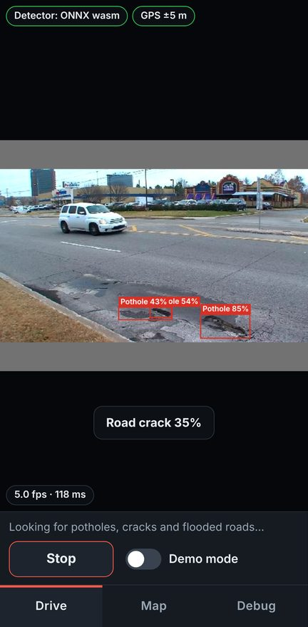
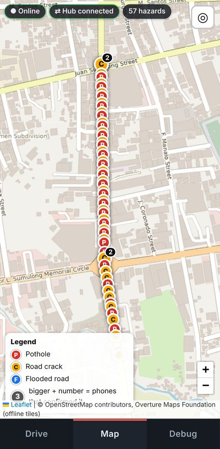
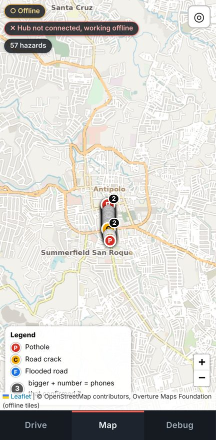

# Rehearsal report

2026-10-09T14:30:42.734Z · **all checks passed** · drive 90 s · camera: model/work/camera/road.y4m · model: app/dist/models/lubak.onnx

Two emulated phones (Chromium, Pixel 7 profile) against the real hub. Not covered: physical camera, real GPS, motion sensors,
WebGPU on a phone GPU, iOS Safari, the hotspot, the mount. Those stay on the human checklist in the README.

| | check | detail |
| --- | --- | --- |
| pass | phone A: HTTPS without a certificate warning, offline cache ready | secure context true, "Offline ready: yes, cached" after 8.7 s |
| pass | phone B: HTTPS without a certificate warning, offline cache ready | secure context true, "Offline ready: yes, cached" after 8.6 s |
| pass | a phone without the event PIN is refused | WebSocket without ?pin= closed with code 4401 (expected 4401) |
| pass | the PIN is remembered and taken out of the address bar | address bar query after load: "?detector=onnx" |
| pass | real detector (not MOCK) | In use: onnx / wasm |
| pass | during the outage the phone knows the hub is gone | phone B sync state: backoff, waiting to sync: 4 |
| pass | the drive produced confirmations from the camera | phone A confirmed 32, phone B 32 |
| pass | both phones and the hub hold the same hazards | hub 57, phone A 57, phone B 57 |
| pass | nothing left waiting to sync, both reconnected | waiting A 0, B 0; state A connected, B connected |
| pass | phone B, 15 s behind, was warned about hazards ahead | Hazard warnings: 21 · last: crack at 42 m |
| pass | hazards confirmed while the hub was down reached it afterwards | 10 hazard(s) first seen during the 16 s outage are on the hub (it held 16 before, 57 after) |
| pass | offline reload: app, hazards and map tiles come from the phone | 57 hazards, 8 tiles from the service worker, 0 failed, network: offline |
| pass | phone A: no uncaught page errors | none |
| pass | phone B: no uncaught page errors | none |

   

## Log

```text
14:28:22  starting the hub on https://127.0.0.1:8543 (fresh store, data in .rehearsal/hub-data)
14:28:23  camera: model/work/camera/road.y4m
14:28:32  PASS  phone A: HTTPS without a certificate warning, offline cache ready: secure context true, "Offline ready: yes, cached" after 8.7 s
14:28:40  PASS  phone B: HTTPS without a certificate warning, offline cache ready: secure context true, "Offline ready: yes, cached" after 8.6 s
14:28:40  PASS  a phone without the event PIN is refused: WebSocket without ?pin= closed with code 4401 (expected 4401)
14:28:40  PASS  the PIN is remembered and taken out of the address bar: address bar query after load: "?detector=onnx"
14:28:45  cross-origin isolated: false (WASM runs single-threaded), 4 logical CPUs
14:28:45  PASS  real detector (not MOCK): In use: onnx / wasm
14:28:45  driving for 90 s at 25.2 km/h; the hub goes down from 30 s to 45 s
14:29:15  hub stopped (it held 16 hazards)
14:29:27  PASS  during the outage the phone knows the hub is gone: phone B sync state: backoff, waiting to sync: 4
14:29:31  hub started again (same certificate, saved snapshot)
14:30:19  phone A: onnx / wasm · inference 105.2 ms last · 107.3 avg · 146.5 p95 · 469 in · 462 processed · 7 dropped (detector busy) · detections 787 · confirmed 32 (0 boosted by a jolt) · not recorded 0 (no usable GPS fix)
14:30:20  phone B: onnx / wasm · inference 119.4 ms last · 104.9 avg · 152.1 p95 · 474 in · 460 processed · 14 dropped (detector busy) · detections 785 · confirmed 32 (0 boosted by a jolt) · not recorded 0 (no usable GPS fix)
14:30:32  phone A after the drive: 57 hazards on the phone · waiting to sync 0 · sync connected
14:30:32  phone B after the drive: 57 hazards on the phone · waiting to sync 0 · sync connected
14:30:32  PASS  the drive produced confirmations from the camera: phone A confirmed 32, phone B 32
14:30:32  PASS  both phones and the hub hold the same hazards: hub 57, phone A 57, phone B 57
14:30:32  PASS  nothing left waiting to sync, both reconnected: waiting A 0, B 0; state A connected, B connected
14:30:32  hazards confirmed by both phones: 3 of 57 (they drive 15 s apart and film the same video at the same time, so few coincide)
14:30:32  PASS  phone B, 15 s behind, was warned about hazards ahead: Hazard warnings: 21 · last: crack at 42 m
14:30:32  PASS  hazards confirmed while the hub was down reached it afterwards: 10 hazard(s) first seen during the 16 s outage are on the hub (it held 16 before, 57 after)
14:30:42  PASS  offline reload: app, hazards and map tiles come from the phone: 57 hazards, 8 tiles from the service worker, 0 failed, network: offline
14:30:42  PASS  phone A: no uncaught page errors: none
14:30:42  PASS  phone B: no uncaught page errors: none
```
